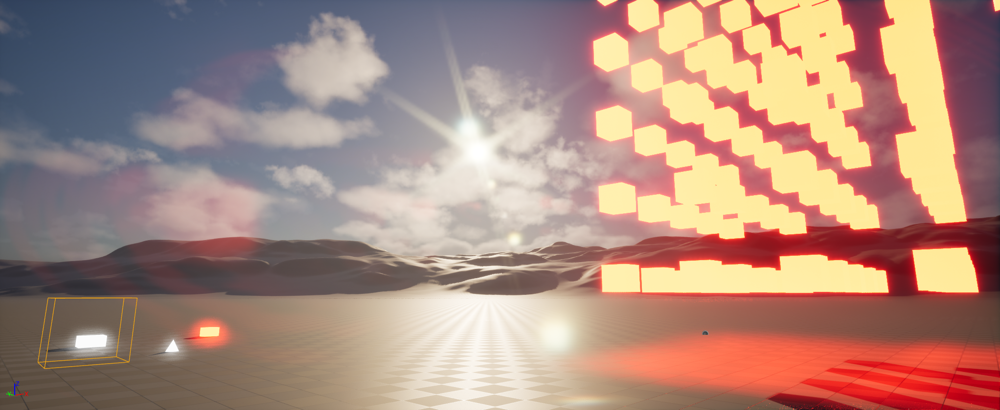



Based on [Custom Lens-Flare Post-Process in Unreal Engine](https://www.froyok.fr/blog/2021-09-ue4-custom-lens-flare/)
by Froyok.

I took the liberty to change some things compared to the original implementation:

- the hook into the engine is not a multicast delegate to make it more clear who is handling the lens flares.
- there is no engine subsystem, instead there is a global scene view extension which is the standard way of extending
  the
  renderer even though none of the overloads are used.
- I added the possibility to scale the individual leaves of the glare effect which allows for somthing similar to
  anamorphic lens flares.

# Installation

## Required Engine Changes

Patches are for Unreal 5.5.4

PostProcessing.h

```diff
+ DECLARE_DELEGATE_RetVal_FourParams( FScreenPassTexture, FLensFlaresHook, FRDGBuilder&, const FViewInfo&, FScreenPassTextureSlice, const class FSceneDownsampleChain&);
+ extern RENDERER_API FLensFlaresHook BloomFlaresHook;
```

PostProcessing.cpp

```diff
+ TAutoConsoleVariable<int32> CVarCustomBloomFlareMode(
+ 	TEXT("r.PostProcessing.CustomBloomFlareMode"),
+ 	1,
+ 	TEXT("If enabled, use external Bloom/Lens-flares rendering"),
+ 	ECVF_Scalability | ECVF_RenderThreadSafe);
+ }
+ 
+ FLensFlaresHook BloomFlaresHook;
```

```diff
		FScreenPassTexture Bloom;
		FRDGBufferRef SceneColorApplyParameters = nullptr;
		if (bBloomEnabled)
		{
+			if ((CVarCustomBloomFlareMode.GetValueOnAnyThread() > 0) && BloomFlaresHook.IsBound())
+			{
+				Bloom = BloomFlaresHook.Execute(GraphBuilder, View, SceneColorSlice, SceneDownsampleChain);
+			}
+			else
+			{
```

## Ini Changes

Reference a settings data asset in your `DefaultGame.ini`. There is one shipped with the project that you can put into
your ini file.

```ini
[CustomLensFlareSceneViewExtension]
ConfigPath = /CustomLensFlare/DA_LensFlaresConfig.DA_LensFlaresConfig
```