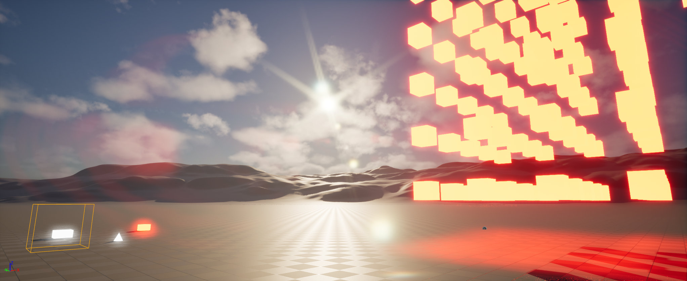




Based on [Custom Lens-Flare Post-Process in Unreal Engine](https://www.froyok.fr/blog/2021-09-ue4-custom-lens-flare/)
by Froyok.

I took the liberty to change some things compared to the original implementation:
- the hook into the engine is not a multicast delegate to make it more clear who is handling the lens flares.
- there is no engine subsystem, instead there is a global scene view extension which is the standard way of extending the 
  renderer even though none of the overloads are used.
- I added the possibility to scale the individual leaves of the glare effect which allows for somthing similar to anamorphic lens flares.

# Installation

## Required Engine Changes

The changes to the engine are really really small. We just add a delegate and a console variable.
There is a patch file that you can apply using `git apply` or `git am`:
- [5.7.4](Engine-Patch-5.7.4.patch)

## Ini Changes

Reference a settings data asset in your `DefaultEngine.ini`. There is one shipped with the project that you can put into your ini file. 

```ini
[CustomLensFlareSceneViewExtension]
ConfigPath=/CustomLensFlare/DA_LensFlaresConfig.DA_LensFlaresConfig
```
